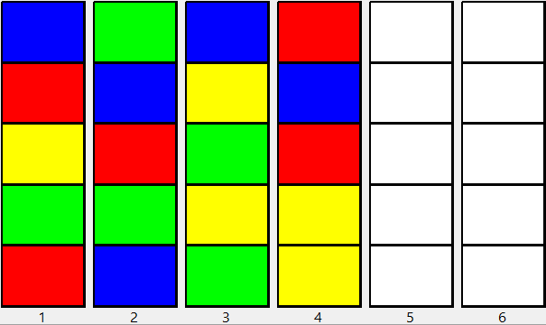

# Color Sorter Puzzle Solver

## Todo

- Add readme and publish to github

## Example

The following puzzle ([source](http://kociemba.org/themen/waterball/colorsort.html)):



Corresponds to the following input:

```
b r y g r
g b r g b
b y g y g
r b r y y
```

And the solver generates the following output:

```
Found solution in 17 steps:
- (04) -> (05)
- (02) -> (06)
- (02) -> (04)
- (02) -> (05)
- (02) -> (06)
- (01) -> (02)
- (01) -> (05)
- (04) -> (02)
- (04) -> (05)
- (01) -> (04)
- (01) -> (06)
- (01) -> (05)
- (03) -> (02)
- (03) -> (04)
- (03) -> (06)
- (03) -> (04)
- (03) -> (06)
```
